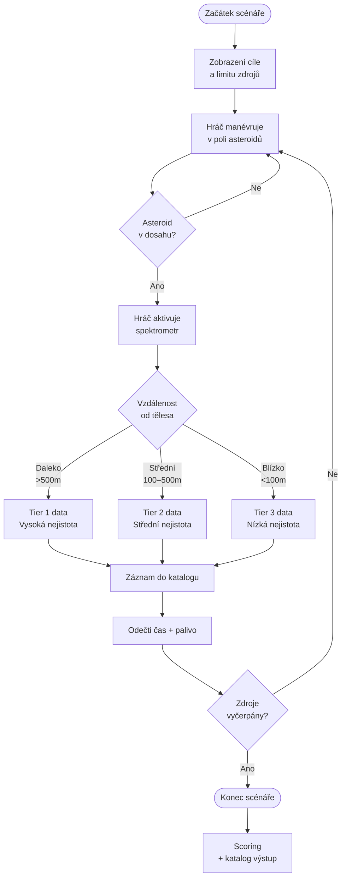
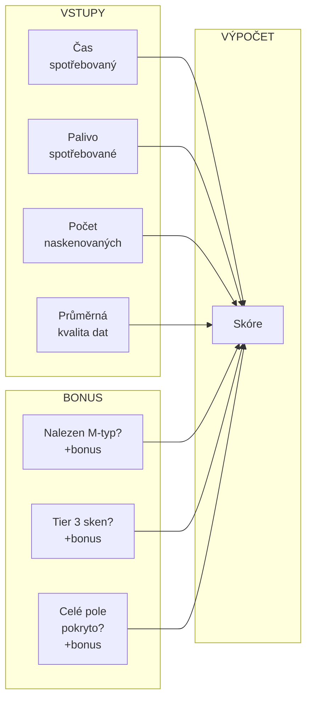
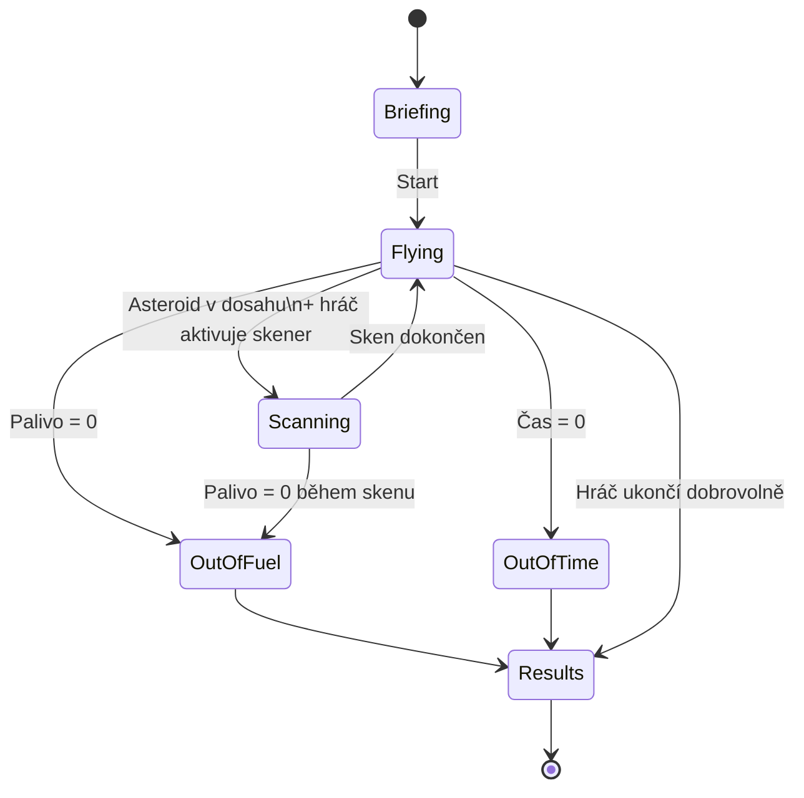
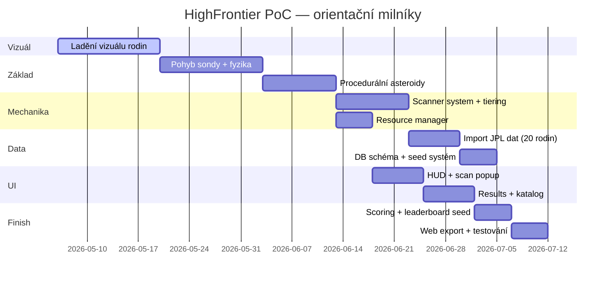

# HighFrontier PoC — Design Document v0.4
## Scénář 1: Survey (hrubé zjišťování)

> Stav: Draft · Technologie: Godot 4 (Web export) · Cíl: hratelné demo přístupu  
> Aktualizace v0.2: rozhodnutí o meta-mapě, DB architektuře, výběru rodin, vizuálním systému  
> Aktualizace v0.3: kompletní matematický model povrchového systému, S-typ parametrická sada, surface inclusion systém  
> Aktualizace v0.4: resource taxonomy (stavební materiály, vzácné látky, neznámo), Tier systém dat průletu/zastávky

---

## 1. Koncept

Hráč řídí průzkumnou sondu v poli asteroidů jedné rodiny.  
Cílem je naskenovat co nejvíce těles spektrometrem a vytvořit katalog  
**za co nejkratší čas a s co nejmenší spotřebou paliva.**

Hra ukazuje reálnou vědeckou logiku:
- různá tělesa vypadají jinak (albedo, tvar, velikost)
- spektrální sken dává informace s mírou nejistoty
- blíže = lepší data, ale stojí to více paliva
- výsledkem je katalog předávaný těžaři (budoucí scénář 2)

---

## 2. Core Loop



---

## 3. Herní objekty

### 3.1 Sonda (hráč)

```
vlastnosti:
  pohyb:    iontový pohon / NTR / VASIMR (volba motoru = herní styl)
  palivo:   H₂O (propellant) — omezený zásobník, viditelný HUD
  čas:      1 herní den = 1 měsíc reálné mise
  skener:   aktivní nástroj s dosahem a zorným úhlem
  katalog:  narůstající databáze skenů
```

**Tři třídy motorů — volba před misí:**

| Motor | Styl hry | Dosah/měsíc | Zastávky | Průlety | Přistání |
|---|---|---|---|---|---|
| Iontový | Průzkumník — mnoho průletů | 5–8 mil. km | 0–1 | 10–30 | ✗ |
| NTR | Všestranný — zastávky i dosah | 3–4 mil. km | 2–5 | 5–15 | ✓ |
| VASIMR | Flexibilní — přepíná režimy | 4–7 mil. km | 1–3 | 15–25 | hraničně |

**Pohybová mechanika (NTR jako referenční):**
```
fáze zrychlení:  ~25 s na 1 km/s  (vysoký tah)
peak rychlost:   2–4 km/s
dosah při Δv 5 km/s: ½ × 2.5 km/s × 30 dní × 86 400 s = 3.24 mil. km

průzkumné Δv se odečítá z měsíčního budgetu
→ více průzkumu = kratší dosah večerního přesunu base
```

### 3.2 Asteroid

Každé těleso má dvě vrstvy dat:

```
VIDITELNÉ (před skenem):
  vizuální_třída:   tvar, velikost, albedo, rotace
  
SKRYTÉ (odhalí sken):
  spektrální_třída:   C / S / M / V / E / D
  složení_odhad:      % silikát / kov / volatily / organika
  nejistota:          ±% závislá na vzdálenosti skenu
  heterogenita:       bool — homogenní / heterogenní povrch
  přítomnost_vody:    bool + confidence %
  pevnost_odhad:      soft / medium / hard  [pro těžaře]
  pórovitost_odhad:   % [pro těžaře]
```

### 3.3 Katalogový záznam

Výstup každého skenu:

```yaml
asteroid_id: A-0042
sken_vzdálenost_m: 230
tier: 2
spektrální_třída:
  hodnota: "C"
  confidence: 0.74
složení:
  silikáty:   { min: 55, max: 72, unit: "%" }
  voda_vaz:   { min: 4,  max: 11, unit: "%" }
  kovy:       { min: 0,  max: 6,  unit: "%" }
přítomnost_vody:
  hodnota: true
  confidence: 0.61
pevnost: { hodnota: "soft", confidence: 0.55 }
```

---

## 4. Scoring



**Vzorec (orientační):**
```
skóre = (naskenovaných × kvalita_avg × 100)
        / (čas_s × 0.3 + palivo_% × 0.7)
        + bonusy
```

Hráč vidí skóre **i** výsledný katalog — odměna je dvojí:
numerická (leaderboard) i vizuální (co jsem se dozvěděl).

---

## 5. Scénář: struktura jednoho levelu



---

## 6. Meta-mapa a struktura světa

### 6.1 Rozhodnutí ✅

- **Denní výzva (varianta C):** Všichni hráči vidí stejných 10 rodin za den. Seed = datum. Leaderboard je srovnatelný.
- **Cestování v PoC:** Bez herní ceny — výběr rodiny = výběr levelu v menu.
- **Cestování ve full game:** Orbitální mechanika (Keplerovy orbity, předpočítaná delta-v lookup tabulka). V PoC pouze ilustrace.
- **Cluster = deterministická scéna:** Rodina se vygeneruje ze fixed seedu při příletu. Vypadá vždy stejně pro všechny hráče.
- **Rotační fáze těles:** Odvozena od herního času — těleso se točí reálně, hráč ho vždy najde kde má být.
- **Hráčovy skeny jsou persistentní** v katalogu, nezávisle na regeneraci scény.

### 6.2 Struktura světa

```
Sluneční soustava (meta-mapa)
└── ~20 rodin v PoC (z JPL dat)
    └── každá rodina = deterministická 3D scéna
        └── seed uložen v DB → stejný výsledek vždy
```

---

## 7. Databázová architektura

### 7.1 Princip

Data jsou rozdělena do tří vrstev podle míry determinismu:

| Vrstva | Obsah | Uložení |
|--------|-------|---------|
| **Identita** | orbitální elementy, spektrální třída, albedo rozsah, složení rozsahy, family seed | DB (statická) |
| **Charakter** | tvar meshe, rotační osa, rodinné rozložení | odvozeno ze seedu (deterministické) |
| **Instance** | rotační fáze, drobné povrchové detaily | klient (per-session) |

### 7.2 Zdroj dat

- **Primární:** JPL / AstDyS (orbitální elementy), WISE/NEOWISE (albeda, průměry), Nesvorný 2015/2024 (členství v rodinách)
- **Princip:** začít tím, co je known s nejvyšší jistotou. Chybějící data = hráčova mise.
- **Nejistota v datech je feature:** albedo chybí u ~60 % těles → průměr je odhad → to *je* Tier 1/2/3 mechanismus.

Hráč svými skeny de facto **vyplňuje mezery v reálném vědeckém katalogu.**

---

## 8. Výběr 20 rodin pro PoC

Rodiny vybrány pro maximální vědeckou přesnost (dobrá data) i herní různorodost (spektrum, albedo, výzva).

### Vnitřní pás (a < 2.5 AU)

| Rodina | Typ | Albedo | Herní výzva | Poznámka |
|--------|-----|--------|------------|----------|
| **Vesta** | V | ~0.40 | hustota, navigace | Dawn spacecraft — nejlepší data vůbec |
| **Massalia** | S | ~0.22 | tempo, tutorial | extrémně homogenní — ideální první level |
| **Flora** | S | ~0.25 | interlopeři | ~30 % nečlenů, zdroj L-chondritů |
| **Baptistina** | C | ~0.06 | tmavé detekce | možný původce K-Pg impaktoru |
| **Erigone** | C(h) | ~0.05 | blízkost nutná | hydratovaná, spektrální absorpce 0.7 μm |
| **Hungaria** | E | ~0.45 | oslnění, vzdálenosti | nejsvětlejší tělesa v pásu |

### Střední pás (2.5–3.0 AU)

| Rodina | Typ | Albedo | Herní výzva | Poznámka |
|--------|-----|--------|------------|----------|
| **Eunomia** | S | ~0.21 | největší S-typ v pásu | dobře charakterizovaná |
| **Maria** | S | ~0.24 | blízkost 3:1 rezonance | zajímavá dynamika |
| **Agnia** | S | ~0.23 | hutný cluster | velmi čistý S-typ |
| **Gefion** | S | ~0.22 | bohatý na železo | mineralogicky zajímavá |
| **Merxia** | S | ~0.23 | kompaktní | dvojice s Agnia pro srovnání |
| **Adeona** | Ch | ~0.06 | tmavé C s vodou | přechod k vnějšímu pásu |
| **Dora** | Ch | ~0.07 | těsné tmavé | Ch-typ, odlišná od Adeona |

### Vnější pás (3.0+ AU)

| Rodina | Typ | Albedo | Herní výzva | Poznámka |
|--------|-----|--------|------------|----------|
| **Koronis** | S | ~0.21 | řídká, vzdálenosti | nejhomogennější S — etalon |
| **Eos** | K | ~0.16 | unikátní spektrum | K-typ = olivin+pyroxen |
| **Themis** | C | ~0.07 | tma, voda | první detekce vody/ledu na asteroidu |
| **Hygiea** | C | ~0.07 | velké C těleso | 4. největší asteroid |
| **Meliboea** | C | ~0.06 | vzdálený, tmavý | záměrně méně prozkoumaná |
| **Veritas** | C | ~0.07 | mladá rodina | stará ~8 Myr — tělesa stále blízko |
| **Ursula** | C/P | ~0.05 | hranice poznání | nejistá taxonomie — hráč to ví |

---

## 9. Vizuální systém asteroidů

### 9.1 Princip: hierarchie příznaků

Vizuální identita pracuje na dvou úrovních — jako lidské vnímání podobnosti:

```
VZDÁLENÝ POHLED → hrubé příznaky → rozpoznám rodinu
BLÍZKÝ POHLED  → jemné příznaky → rozpoznám konkrétní těleso
```

### 9.2 Spektrální paleta (rodinné konstanty)

| Třída | Barva base | Barva worn | Albedo | Charakter |
|-------|-----------|------------|--------|-----------|
| C  | [38, 34, 40] tmavě šedá | [24, 22, 26] | 0.055 | velmi tmavý, homogenní |
| Ch | [34, 40, 46] tmavě šedá/modravá | [22, 28, 34] | 0.050 | jako C + hydroxyl tint |
| S  | [168, 138, 72] teplá zlatavá ↔ [122, 98, 80] šedohnědá | [158, 70, 46] rezavá | 0.22 | viz 9.4 |
| V  | [112, 42, 36] tmavě červená | [80, 26, 22] | 0.38 | bazalt + ejecta kontrast |
| E  | [232, 226, 218] bílá | [208, 202, 196] | 0.46 | nejsvětlejší třída |
| K  | [160, 132, 76] zlatohnědá | [128, 104, 56] | 0.16 | olivin+pyroxen přechod |
| M  | [140, 138, 136] kovová šedá | [112, 110, 108] | 0.17 | Fe-Ni dominantní |

### 9.3 Povrchový systém — matematický model

Render je pixel-by-pixel na canvas. Každý bod na povrchu prochází vrstvami v tomto pořadí:

#### Vrstva 1: Základní barva + space weathering

```
base_color = lerp(pyroxen_col, olivin_col, olivin_bias)   # S-typ specifické
base_color = lerp(base_color, old_col, weathering × 0.68)

# FBM gradient — čerstvé vs. zvětralé plochy
w = fbm(θ×1.1, φ×1.1, seed+500, octaves=4) × 0.5 + 0.5
color = lerp(color, fresh_col, (1−w) × (1−weathering) × 0.45)
```

#### Vrstva 2: Velkoškálové barevné skvrny (mineralogické zóny)

```
patch = fbm(θ×0.85, φ×0.85, seed+900, octaves=3)
color.R += patch × contrast × 32
color.G += patch × contrast × 19
color.B += patch × contrast × 8
```

#### Vrstva 3: Fe-Ni kovové žíly (S, M typy)

```
metal_fbm = fbm(θ×3.6, φ×3.6, seed+800, octaves=3) × 0.5 + 0.5
threshold = 1 − metal_veins × 0.72
metal_mask = clamp((metal_fbm − threshold) / (1−threshold) × 2.8, 0, 1)
color = lerp(color, metal_color=[194,190,184], metal_mask × 0.78)

# Spekulární highlight na kovu
specular = max(0, reflect(N,L).z)^20 × metal_mask × 0.65
color += specular × [85, 82, 75]
```

#### Vrstva 4: Mikrotextura (fine noise)

```
fine = fbm(θ×5.5, φ×5.5, seed+300, octaves=4) × 11
```

#### Vrstva 5: Hladké regolith oblasti

Fyzikální základ: regolith migruje seismickým otřesem do topografických minim.

```
smooth_fbm = fbm(θ×0.72, φ×0.72, seed+600, octaves=2)
threshold  = smooth_fraction − 0.5          # smooth_fraction ∈ [0, 0.5]
smooth_mask = sigmoid((smooth_fbm − threshold) / ε)

color += fine × (1 − smooth_mask × 0.88)   # hladká plocha = bez mikrotextury
color.R −= smooth_mask × 7                 # mírně tmavší
```

Parametr `ε` kontroluje ostrost hranice (malé = ostrá, velké = difuzní).

| S-typ | smooth_fraction | ε |
|-------|----------------|---|
| Flora (Itokawa-like) | 0.40–0.45 | 0.06 (ostrá) |
| Koronis, Agnia | 0.18–0.24 | 0.09 |
| Eunomia, Gefion | 0.10–0.15 | 0.10 |

#### Vrstva 6: Balvany (boulder system)

**Velikostní distribuce — power law:**

```
D = D_min × (1 − u)^(−1/(α−1)),   u ~ U(0,1)
```

| Parametr | Popis | Koronis | Flora |
|----------|-------|---------|-------|
| α | strmost distribuce | 2.8 | 2.6 |
| D_min | min velikost / R₀ | 0.015 | 0.020 |
| D_max | max velikost / R₀ | 0.17 | 0.24 |
| N | počet balvanů | 42 | 52 |

**Rozmístění — Poisson disk na sféře:**

Minimální úhlová vzdálenost mezi balvany: `d_min(i,j) = (sz_i + sz_j) × 1.12`

**Vizuální efekt balvanu (texturový přístup):**

```
# Pro každý pixel: 2D projekce balvanu na canvas
bump(t) = (1 − t²)²,   t = d_2d / r_px ∈ [0,1]

color += bump × rough_factor × albedo_contrast
lighting += bump × 0.32 − (1−bump) × 0.09   # self-shadowing na okrajích
```

`rough_factor = 1 − smooth_mask × 0.9` — balvany jsou potlačeny v hladkých oblastech.

> **🔓 Otevřené téma:** Boulder geometrie — pokud texturový přístup způsobí vizuální repetitivnost (zejména u velkých těles nebo blízkého pohledu), přejít na skutečné výstupky v Fourier/mesh vrstvě.

> **🔓 Otevřené téma:** FBM pro smooth oblasti ideálně koreluje s topografií Fourier tělesa (konkavity přitahují regolith). V PoC používáme nezávislý šum — pokud bude vypadat náhodně bez vazby na tvar, zvážit propojení s Fourier koeficienty.

#### Vrstva 7: Surface inclusions (cross-type balvany)

Fyzikální základ: rubble pile těleso je sestaveno z fragmentů různých zdrojů. Část balvanů má odlišnou spektrální třídu než hostitelské těleso.

**Klíčové rozlišení:**

```
family_interloper_rate   → % celých TĚLES v poli rodiny jiného původu
                           (herní mechanika: z 10 těles ve scéně jsou N cizí)

surface_inclusion_rate   → % balvanů na povrchu JEDNOHO tělesa jiné třídy
                           (vizuální mechanika: tmavé/červené/kovové skvrny)
```

Tyto dvě hodnoty jsou nezávislé a nekombinují se.

**Surface inclusion rate — definice a vědecky kalibrované hodnoty:**

`surface_inclusion_rate` = podíl **povrchové plochy** pokrytý cizím materiálem (ne podíl balvanů počtem).

Model přepočítá na počet balvanů automaticky:
```
iRate_count = iRate_area / boulder_coverage_fraction

boulder_coverage_fraction = Σ π·rᵢ² / π·R²   (suma přes viditelné balvany)
```

| Velikost tělesa | Rubble pile? | surface_inclusion_rate (% plochy) |
|----------------|-------------|----------------------------------|
| < 150 m | spíše monolitický | < 1 % |
| 150 m – 1 km | přechodový | 2–8 % |
| 1 – 10 km | typický rubble pile | 5–15 % |
| > 10 km | kompaktní + regolith | 3–10 % |

**Typy inkluzí a jejich vizuál:**

| Inclusion typ | Barva | Spekulár | Vědecký původ |
|--------------|-------|---------|---------------|
| C (tmavý) | [20, 18, 22] téměř černá | nízký | dopadlý uhlikatý chondrit |
| V (červený) | [88, 28, 22] tmavě červená | nízký | bazalt z Vesty/diferencovaného tělesa |
| M (kovový) | [188, 184, 178] stříbrná | vysoký (spec^16) | fragment Fe-Ni jádra |

**Herní mechanismus:** hráč vidí vizuálně anomální balvan na povrchu → Tier 3 sken odhalí cross-type spektrum → vědecký nález.

### 9.4 S-typ — parametrický prostor (primární herní třída)

S-typ má nejvíce rodin v PoC a nejvyšší potenciál vizuální diverzity. Je primárním cílem průzkumu pro mineralogickou hodnotu (olivin/pyroxen poměr, PGM inkluze).

**6D parametrický prostor rodin:**

| Rodina | olivin_bias | metal_veins | smooth_fraction | weathering | boulder_size | color_contrast | inclusion_rate (% plochy) | inclusion_typ |
|--------|------------|------------|----------------|-----------|-------------|---------------|--------------------------|--------------|
| Koronis | 0.40 | 0.08 | 0.22 | 0.82 | 0.36 | 0.20 | 1 % | C |
| Flora | 0.63 | 0.17 | 0.42 | 0.36 | 0.52 | 0.60 | 10 % | C+V |
| Eunomia | 0.26 | 0.30 | 0.14 | 0.64 | 0.78 | 0.38 | 5 % | C |
| Maria | 0.54 | 0.22 | 0.21 | 0.55 | 0.50 | 0.44 | 6 % | C |
| Agnia | 0.48 | 0.09 | 0.18 | 0.68 | 0.34 | 0.26 | 2 % | C |
| Gefion | 0.20 | 0.50 | 0.11 | 0.74 | 0.64 | 0.34 | 6 % | M |
| Merxia | 0.44 | 0.11 | 0.20 | 0.60 | 0.40 | 0.28 | 3 % | C |

**Vědecká motivace parametrů:**
- `olivin_bias`: poměr olivin/pyroxen odpovídá meteorit. taxonomii (LL vs. H chondrity)
- `metal_veins`: Fe-Ni obsah; Gefion = fragment Fe-bohatého tělesa
- `smooth_fraction`: sedimentace regolitu; Flora ≈ Itokawa (~40 %)
- `weathering`: stáří povrchu; Koronis = stará, Flora = dynamičtější prostředí
- `boulder_size`: velikostní distribuce; velká tělesa = větší balvany
- `color_contrast`: mineralogická heterogenita; Flora = vyšší díky příměsím

### 9.5 Motivace hráče k skenování podle spektrální třídy

| Třída | Proč skenovat | Co Tier 3 odhalí navíc |
|-------|--------------|----------------------|
| **S** | mineralogická varieta, olivin/pyroxen poměr, PGM inkluze | přesný poměr, M-inkluze = jackpot |
| **C/Ch** | voda pro palivo | hydroxyl absorpce, He-3 saturace (stáří) |
| **M** | nejvyšší ekonomická hodnota (PGM) | Pt/Pd koncentrace, S-plášť zbytky |
| **V** | největší geologická diverzita | eucrit vs. diogenit vs. howardit |
| **K** | unikátní spektrum, přechodový typ | olivin:pyroxen atypický poměr |

**Průmyslově nejcennější prvky** (ovlivňuje scoring těžaře ve scénáři 2):

```
Platinová skupina (PGM): Pt, Pd, Rh, Ru, Ir, Os  → M-typ, S-typ (10–100× zemská kůra)
Voda (H₂O):              vázaná + led             → C, Ch, Themis (palivo in-situ)
Fe-Ni:                   konstrukční kov           → M-typ, S-typ
He-3:                    povrch všech těles         → stáří povrchu (solární vítr)
Ge, Ga, In:              polovodiče                 → S-typ, M-typ (vzácně)
```

---

## 10. Scénář: struktura jednoho levelu (beze změn)


---

## 11. PoC Scope

### ✅ JE v PoC
- 1 scénář (Survey), 20 rodin asteroidů (JPL data)
- Pohyb sondy v 3D (nebo 2.5D — viz otázky)
- Spektrální sken s tieringem dle vzdálenosti
- Vizuálně odlišné asteroidy: tvar (Fourier), albedo mapa (Perlin), velikost (power law)
- HUD: palivo, čas, počet skenů
- Results screen s katalogem
- Jednoduchý scoring
- Denní výzva — fixed seed per den, stejná pro všechny hráče
- Web export (Godot 4)

### ❌ NENÍ v PoC
- Sondy / impaktory (scénář 2)
- Multiplayer / katalog předávání
- Hazardy (kolize, poruchy)
- Delta-v / orbitální mechanika (jen ilustrace)
- Ekonomický systém
- Mobilní optimalizace (až po PoC)

---

## 12. Otevřené otázky a rozhodnutí

### 🎮 Herní mechanika

**O1: 3D vs. 2.5D pohyb?**
Plný 3D je vědecky správnější, ale ovládání na mobilu je složitější.
2.5D (pohyb v rovině, otáčení) je jednodušší pro PoC.
Godot zvládá obojí — ale rozhodnutí ovlivní celý input systém.

**O2: Jak funguje skenování?**
- Varianta A: hráč zastaví a "nabíjí" sken (čas = palivo stojí)
- Varianta B: sken probíhá průběžně při letu, kvalita závisí na době v dosahu
- Varianta B je reálnější (tak funguje NIRS3), ale složitější na implementaci

**O3: Jak vizualizovat nejistotu hráči?**
- Čísla (±30%)? Bary? Barva záznamu? Fuzzy ikonky?
- Musí být čitelné při arcade tempu

**O4: Má mít hráč mapu pole?**
Minimap pomáhá plánovat trasu (klíčové pro skóre),
ale snižuje průzkumný pocit. Kompromis: minimap se odemkne po prvním průletu.

### 🔬 Vědecký model

**O5: Interloper mechanika?**
8–10 % těles ve scéně má jiný spektrální typ než rodina.
Hráč to pozná jen skenem — vědecky přesné a herně zajímavé.
Otázka: má hra interloper nějak odměňovat zvlášť?

**O6: Rotace asteroidů?**
Reálná rotace (hodiny až dny) by ve hře nebyla viditelná.
Zrychlená rotace vizuálně pomáhá, ale zkresluje vědu.
Kompromis: viditelná pomalá rotace, vliv na sken ignorovat v PoC.

### 📱 Technické / Godot

**O7: Input systém**
Desktop PoC: WASD + myš pro míření skeneru.
Mobil (later): virtuální joystick + tap-to-scan.
Godot InputMap umožní přepínání — ale designovat pro desktop first?

**O8: Jak reprezentovat katalog v UI?**
Jednoduchý scrollovatelný list vs. vizuální mapa pole s barevnými tečkami.
Vizuální mapa je silnější (hráč vidí co pokryl), ale složitější na implementaci.

---

## 13. Navrhovaný tech stack (Godot 4)

```
Godot 4.x
├── 3D scene (nebo 2.5D)
│   ├── MeshInstance3D — asteroidy (procedurální mesh, Fourier deformace)
│   ├── ShaderMaterial — albedo mapa (Perlin šum), space weathering
│   └── Camera3D — pohled z kabiny / třetí osoba
├── GDScript
│   ├── AsteroidGenerator.gd   — procedurální generátor (seed → mesh)
│   ├── ScannerSystem.gd       — tiering, nejistota
│   ├── ResourceManager.gd     — palivo, čas
│   ├── CatalogManager.gd      — ukládání skenů
│   └── ScoringEngine.gd       — výpočet skóre
├── UI (Control nodes)
│   ├── HUD.tscn               — palivo, čas, skeny
│   ├── ScanResult.tscn        — popup po skenu
│   └── Results.tscn           — end screen + katalog
└── Export
    └── Web (HTML5)            — PoC distribuce
```

---

## 14. Milníky PoC



---

## 15. Otevřená témata — vizuální systém

| # | Téma | Priorita | Poznámka |
|---|------|---------|----------|
| OT-1 | Boulder geometrie | střední | Pokud textura způsobí repetitivnost → výstupky v Fourier/mesh vrstvě |
| OT-2 | FBM↔topografie korelace | nízká | Hladké plochy ideálně kopírují konkavity Fourier tvaru |
| OT-3 | Tvarový systém (Fourier) | **příští chat** | σ_shape, rodinné vs. individuální složky, spinning top |
| OT-4 | Velikostní distribuce v poli | **příští chat** | Power law na úrovni celé scény, ne jen tělesa |
| OT-5 | Prostorové rozmístění | **příští chat** | Hustota clusteru, seed → layout |
| OT-6 | Krátery | nízká PoC | Výrazné pro V-typ (ejecta); ostatní typy nižší priorita |
| OT-7 | He-3 saturace jako Tier 3 data | nízká | Starší povrch = více He-3; vizuálně nerozlišitelné, jen sken |

---

*Dokument je živý — aktualizovat při každém designovém rozhodnutí.*  
*v0.2 — 2026-05-06 — přidány sekce 6–9 (meta-mapa, DB, rodiny, vizuální systém)*
*v0.3 — 2026-05-10 — kompletní matematický model povrchu, S-typ parametrická sada, surface inclusion systém*
*v0.4 — 2026-05-18 — resource taxonomy, Tier data systém průletu/zastávky*
*v0.5 — 2026-05-25 — motory (Ion/NTR/VASIMR), herní den = 1 měsíc, relativní vektory, vzdělávací obsah*

---

## 16. Resource Taxonomy — Co se dá najít a k čemu to je

### 16.1 Filozofický základ

Prozkoumali jsme spektrálně ~15 % katalogizovaných těles, fyzicky navštívili 8, odebrali vzorky ze 3 (Itokawa, Ryugu, Bennu). Asteroidy jsou zmrazené záznamy raného slunečního systému — obsahují látky které na Zemi buď nejsou, nebo byly zničeny geologickými procesy. **To co nevíme je herní mechanika.**

### 16.2 Co budou vesmírní stavaři potřebovat

#### Konstrukce

| Materiál | Zdroj v asteroidech | Typ | Poznámka |
|---|---|---|---|
| Fe-Ni | M-typ, S-typ | hojný | základ všeho |
| Ti (titanium) | V-typ fragmenty (ilmenit FeTiO₃) | uncommon | lehký, pevný, korozivzdorný |
| Al (hliník) | kůra diferenciovaných těles | uncommon | stavba, elektrika |
| Cr, V, Mn | S/M-typ | uncommon | ocelové slitiny |
| W (wolfram) | M-typ vzácně | rare | nejvyšší teplota tání, řezné nástroje |
| Si (křemík) | všudypřítomný v silikátech | hojný | solární panely, elektronika, sklo |
| C (uhlík jako prvek) | C-typ, D-typ | rare–exotic | viz 16.3 |

#### Propellant a energie

| Látka | Zdroj | Použití |
|---|---|---|
| H₂O | C/Ch-typ, Themis, vnější pás | elektrolýza → H₂/O₂ (rakety) |
| CH₄ (methan) | Sabatierova reakce: CO₂ + H₂ | palivo, chemická syntéza |
| He-3 | povrch všech těles (solární vítr) | D-T fúzní palivo |
| U, Th | trace v kamenných typech | štěpení |

#### Elektronika a baterie — kritický bottleneck

| Materiál | Zdroj | Použití |
|---|---|---|
| REE (Nd, Dy, La, Gd) | diferenciovaná tělesa, V-typ | magnety, elektronika |
| Li, Co | C-typ | baterie |
| Ge, Ga, In | S-typ, M-typ vzácně | polovodiče |
| Cu | M-typ, S-typ | vedení, elektronika |
| Au | M-typ, S-typ | kontakty, korozivzdornost |

#### Life support a zemědělství

| Látka | Zdroj | Poznámka |
|---|---|---|
| N (dusík) | D/P-typ vnějšího pásu (amoniak NH₃) | **velmi vzácný v asteroidech** — možná cennější než zlato; hnojiva, life support |
| P (fosfor) | C-typ, D-typ (schreibersite Fe₃P) | hnojiva, DNA/RNA syntéza |
| O₂ | elektrolýza H₂O, redukcí silikátů | dýchání, oxidant |

### 16.3 Uhlík jako prvek — zvláštní kapitola

C-typ a D-typ obsahují uhlík vázaný i volný. Volný uhlík má mimořádnou hodnotu pro stavbu:

| Forma | Reálnost | Hodnota |
|---|---|---|
| Grafit | ✓ běžný v meteoritech | prekurzor uhlíkového vlákna, mazivo |
| Mikrodiamanty | ✓ nalezeny v ureilitech, Canyon Diablo | řezné nástroje, elektronika |
| Lonsdaleite | ✓ hexagonální diamant, impaktový šok | tvrdší než klasický diamant (teoreticky) |
| Fullereny C₆₀ | ✓ vzácně v meteoritech | zachycené vzácné plyny, nanomateriály |
| Grafén prekurzor | plausibilní ze grafitu | strongest material known |

### 16.4 Organika a prebiotická chemie

Vědecky potvrzené nálezy v meteoritech — **asteroidy jsou tedy reálným zdrojem**:

| Látka | Potvrzeno | Kde | Herní hodnota |
|---|---|---|---|
| Aminokyseliny (70+ druhů) | ✓ Murchison, Ryugu 2022 | C/D-typ | farmaceutika, exobiologie |
| Ribóza (cukr RNA) | ✓ 2019, Oba et al. | C-typ | základ nukleotidů — extrémně vzácné |
| Nukleobáze (adenin, guanin, uracil) | ✓ Murchison, NWA 7325 | C/D-typ | farmaceutika, vědecká senzace |
| PAH (polycyklické aromatické UH) | ✓ běžné v C-typech | C/D-typ | průmyslová chemie |
| Tholiny | pravděpodobné v D/P-typech | D-typ | komplexní polymery, neznámé využití |
| Chirální asymetrie (L-aminok.) | ✓ v meteoritech jako na Zemi | C-typ | záhada původu života |

### 16.5 Exotické a neočekávané nálezy

| Látka | Základ | Vědecká hodnota |
|---|---|---|
| Kvazikrystaly (icosahedrite) | ✓ Khatyrka meteorit — první přirozený kvazikrystal v historii | Nobel Prize materiál; co dalšího čeká? |
| Presolarní zrna SiC | ✓ Murchison, Allende — vznikly v hvězdách PŘED slunečním systémem | jiné izotopové poměry; záznamy jiných hvězd |
| Xenolity | plausibilní — impakty doručují materiál z jiných těles | fragment Ceres, Vesty, nebo Marsu na asteroidu? |
| Remanentní magnetismus | ✓ M-typ, některé chondrity | záznam magnetického pole raného slunečního systému |
| Tritium ³H | ✓ vzniká kosmickým spallací, polocas 12.3 let | fúzní palivo; jen na povrchu, kontinuálně produkováno |

### 16.6 Resource Taxonomy — herní hierarchie vzácnosti

```
COMMON     Fe, Si, Ni, Mg, O        vždy přítomno, základ konstrukce
UNCOMMON   Ti, Al, Cr, Co, Cu, Au   závisí na spektrálním typu
RARE       PGM (Pt, Pd, Ir, Rh),    M/S jackpot; REE pro elektroniku
           REE, W, Ge, Ga
EXOTIC     He-3, H₂O (v S-poli),    typ-specifické; těžko detekovatelné
           C-organika, aminokyseliny,  bez Tier 3 skenu
           N-sloučeniny, P, Li
LEGENDARY  mikrodiamanty, lonsdaleite,  < 0.5 % těles; vizuální/
           kvazikrystaly, presolarní    anomální signál; vědecká senzace
           zrna, ribóza, nukleobáze,
           aktivní asteroid (led+plyn),
           xenolity
UNKNOWN    ???                          D-typ, P-typ, neznámá taxonomie;
                                        malý % těles má náhodný objev
                                        který není v žádném katalogu
```

**UNKNOWN kategorie** — klíčová herní mechanika: tělesa bez spektrální klasifikace (reálně ~85–90 % Flora pole) mají šanci obsahovat nález který nelze predikovat. Hráč ho nemůže naplánovat — může jen najít. Silný motivátor průzkumu i "zbytečných" flyby.

### 16.7 Tier systém odhalování dat

#### Tier 1 — katalog (před příletem)
Veřejně dostupná data z pozemských pozorování. Pro ~85 % těles pole Flora jsou to jen odhady nebo prázdná pole.

#### Tier 2 — průlet (close flyby)
Měřitelné palubními nástroji při průletu bez zastavení:

- **Hmotnost** — z gravitační perturbace trajektorie (standard: NEAR, Hayabusa, Dawn)
- **Hustota** — hmotnost / objem → anomálie hustoty = hint na kovové jádro
- **Tvar přesný** — zobrazovací systém; contact binary? top-shape (YORP)?
- **Rotace** — perioda + osa; tumbling = nedávná kolize
- **Albedo** — fotometricky; neznámá tělesa dostávají první odhad
- **Spektrální třída** — potvrzení nebo překvapení (interloper!)
- **Magnetické pole** — magnetometr; M-typ, kovové inkluze
- **Binární satelit** — přímá detekce při průletu
- **Rovníkový debris ring** — YORP kandidát; volný materiál

#### Tier 3 — zastávka + sondy
Vyžaduje zastavení a vypuštění povrchových sond:

- **Přesné elementární složení** — XRF spektrometrie, gama-záření
- **Mineralogické poměry** — olivin/pyroxen %, Fe-Ni fáze, hydratace
- **Organická chemie** — aminokyseliny, nukleobáze, PAH, tholiny
- **Vnitřní struktura** — seismika (geofony + impakt); rubble pile vs. monolitický skutečně
- **Pórovitost** — z hmotnosti + objemu + seismiky
- **Povrchové inkluze** — identifikace cross-type balvanů
- **Čerstvý kráter** — přístup k subpovrchovému materiálu
- **UNKNOWN nálezy** — jen Tier 3 odhalí co katalog neví
